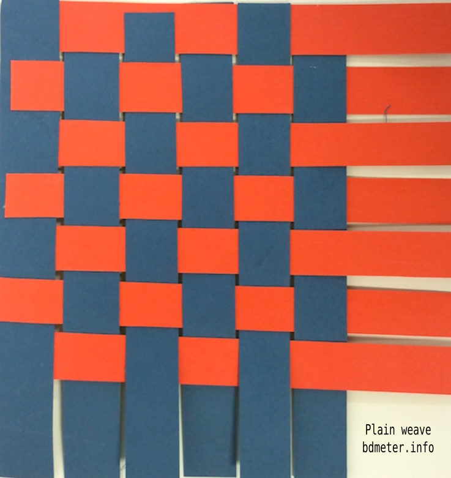

If you want to buy an industrial-grade weaving or knitting machine, then you have to understand the below things clearly:

1\. Basics of technical textile terms  
2\. Textile Fabric types  
3\. Type of weave structure  
4\. Type of knit structure  
5\. built a generation of machines  
6\. Production output of the machine

Textile fabrics are most commonly woven but may also be produced by knitting, felting, lace making, net making, nonwoven processes, and tufting, or a combination of these processes. Most fabrics are two-dimensional but an increasing number of three-dimensional woven technical textile structures are being developed and produced. Woven fabrics generally consist of two sets of yarns that are interlaced and lie at right angles to each other. The threads that run along the length of the fabric are known as warp ends whilst the threads that run from selvage to selvage, that is from one side to the other side of the fabric, are weft picks. Frequently they are simply referred to as ends and picks. In triaxial and in three-dimensional fabric yarns are arranged differently. Woven technical textiles are designed to meet the requirements of their end-users. Their strength, thickness, extensibility, porosity, and durability can be varied and depend on the weave used, the thread spacing, that is the number of threads per centimeter, and the raw materials, structure (filament or staple), linear density (or count) and twist factors of the warp and weft yarns. From woven fabrics, higher strengths and greater stability can be obtained than from any other fabric structure using interlaced yarns. Structures can also be varied to produce fabrics with widely different properties in the warp and weft directions.

Textile fabric types:  
1\. Woven fabrics  
2\. Knitted fabrics

Woven fabric structures: The number of weave structures that can be produced is practically unlimited. In this section basic structures, from which all other weave structures are developed, are discussed. Also briefly referred to are lenos, because of their importance in selvage constructions, and triaxial fabrics, because they show simple structural changes which can affect the physical properties of fabrics. Most two-dimensional woven technical fabrics are constructed from simple weaves and of these at least90% use plain weave. Simple cloth constructions are discussed in greater detail by Robinson and Marks whilst Watson describes a large variety of simple and complicated structures in great detail.

Plain weave: Plain weave is the simplest interlacing pattern that can be produced. It is formed by alternatively lifting and lowering one warp thread across one weft thread. Figure 4.1 shows 16 repeats (four in the warp and four in the weft direction) of a plain weave fabric in plan view and warp way and weft way cross-sections through the same fabric. The diagrams are idealized because yarns are seldom perfectly regular and the pressure between the ends and picks tends to distort the shape of the yarn cross-sections unless the fabrics are woven from monofilament yarns or strips of film. The yarns also do not lie straight in the fabric because the warp and weft have to bend around each other when they are interlaced.

Plain weave

  
Diversity of plain weave fabrics  
The characteristics of the cloths woven will depend on the type of fibre used for producing the yarn and whether it is a monofilament yarn, a flat, twisted or textured (multi-)filament yarn or whether it has been spun from natural or manufactured staple fibres. The stiffness of the fabrics and its wearability will also be affected by the stiffness of the raw materials used and by the twist factor of the yarn, that is the number of turns inserted in relation to its linear density. Very highly twisted yarns are sometimes used to produce special features in plain weave yarns. The resulting fabrics may have high extensibility or can be semiopaque. The area density of the fabric can be varied by changing the linear density or count of the yarns used and by altering the thread spacing, which affects the area covered by the yarns in relation to the total area. The relation between the thread spacing and the yarn linear density is called the cover factor. Changing the area density and/or the cover factors may affect the strength, thickness, stiffness, stability, porosity, filtering quality and abrasion resistance of fabrics. Square sett plain fabrics, that is fabrics with roughly the same number of ends and picks per unit area and warp and weft yarns of the same linear densities are produced in the whole range of cloth area densities and cloth cover factors. Low area density fabrics of open construction include bandages and cheesecloths, light area density high cover factor fabrics include typewriter ribbons and medical filter fabrics, heavy open cloths include geotextile stabilization fabrics and heavy closely woven fabrics include cotton awnings. Warp-faced plain fabrics generally have a much higher warp cover factor than weft cover factor. If warp and weft yarns of similar linear density are used, a typical warp-faced plain may have twice as many warps end as picks. In such fabrics, the warp crimp will be high and the weft crimps extremely low. The plan view and crosssections of such a fabric are shown in Fig. 4.3. By the use of suitable cover factors and choice of yarns, most of the abrasion on such a fabric can be concentrated on the warp yarns and the weft will be protected. Weft-faced plains are produced by using much higher weft cover factors than warp cover factors and will have higher weft than warp crimp. Because of the difference in weaving tension the crimp difference will be slightly lower than in warp-faced plain fabrics. Weft-faced plains are little used because they are more difficult and expensive to weave.
