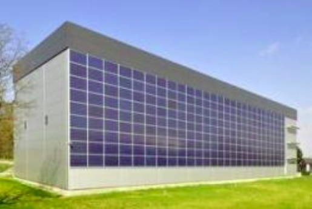
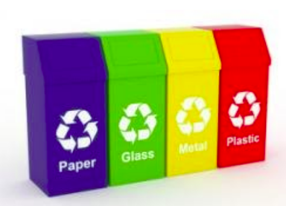
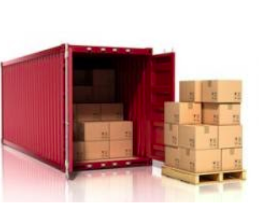
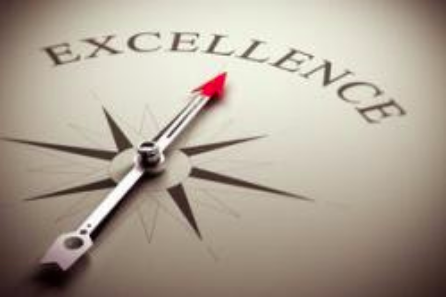

## Energy Efficiency

Reducing your energy consumption is a great way to reduce both costs and greenhouse gas emissions. Lowering your utility costs and reducing your environmental impact also helps your factory prepare for new policies and regulatory requirements, improve your competitive advantage and grow your business efficiently.  
  
Conducting an energy audit of your facilities is the best way to start. It will help you assess your energy usage and identify what you can do to lower energy consumption, including changes to behavior, equipment, and processes, and how much can be potentially saved. Assessing energy usage throughout your operations will enable you to identify energy efficiency opportunities in the following areas:  
  
1\. Lighting  
2\. Building Efficiency  
3\. Heating and Cooling  
4\. Machinery and Equipment  
5\. Operations

## **Corporate Resources**

Corporate resources provide a wide range of material to help you to understand more about Corporate standards.

- Corporate tutorial is designed to assist our suppliers to address Zero Tolerance, Critical and Major issues found in their workplaces, which they are required to remediate to comply with Corporate’s Code of Conduct for Suppliers and so that our business relationship may continue to grow.
- Risk mapping are the useful resources for searching and practical tools as sustainable capacity building support to global vendor factories covering for the environmental, health & safety (EHS) common compliance risks and practical remediation suggestions. EHS risk mapping manual aiming for:-
    - Understand of the Common EHS Hazards found in the factory driven by Production Process / Task, key focus on vendor factory’s manufacturing operation of Softline & Hardline Products
    - Holistic mapping of the Major EHS Risks & Practical Control Measures of Corporate key Softline & Hardline Products.

### Sustainable Buildings

For a building to be sustainable, many factors need to be considered, such as indoor air quality, energy, and water efficiency, and the use of green materials.

An efficient, sustainable building can reduce operational costs by as much as 30 - 50% from energy savings and 40 - 50% from water savings.

For your existing buildings, you can achieve savings by retrofitting exterior and interior fixtures and items, which can be easily replaced at a low cost. The savings you gain from these retrofits often have short payback periods on initial investment costs.

Examples of these opportunities include:

- Replacing current lighting with energy-efficient lighting, such as switching T8 to T5 bulbs and installing LED and CFLs;
- Installing insulation into building walls, particularly on the darker, shady side of buildings;
- Replacing old Bdmeter with new ones which are better insulated and adding sun shades;
- Making the building shell as air tight as possible to avoid seepage of cool or warm air outside;
- Using passive cooling and heating (e.g. shading, reflectors, identifying natural "cold spots"); and
- Selecting sustainable materials for renovation and construction activities.

### Waste Management

Finding opportunities to reduce waste will help you better manage your use of materials and your waste streams, and bring you to cost savings. You can reduce your waste by:

1) Maximizing your material utilization - being efficient with your materials to avoid consumption and reduce waste where possible. Immediate benefits include:

- Reduced costs in material consumption
- \- this benefits the environment and brings cost savings to your business; and
- Reduced costs for waste disposal
- \- by reducing the need for 'conventional' waste disposal systems, like landfill and incineration.

2) Recycling and reusing materials where possible - conducting a waste audit to find out where waste can be avoided or reduced, and better managed, will help you identify:

- Material use and operational efficiencies;
- Potential cost savings and / or revenue generating opportunities;
- Opportunities to reduce, reuse and recycle your materials / waste; and
- Areas where waste storage and disposal can be better managed to minimize health and disease risks and environmental impacts.

### Greenhouse Gasses

Greenhouse gases (GHGs) include carbon dioxide, methane, nitrous oxide, and water vapor. GHG emissions from manufacturing primarily result from the burning of fossil fuels for heat and power generation. Reducing your factory's GHG emissions will save you money, make you less vulnerable to power shortages and lower your dependence on fossil fuels, such as oil and gas.

You can determine your factory's carbon footprint by measuring your GHGs through these steps:

1) Define the scope of activities that you will measure - the best way is to separate your direct and indirect carbon emissions using these Scope categories:

- Scope 1 - all direct GHG emissions
- (e.g. emissions from on-site power generation, fuel usage)
- Scope 2 - indirect GHG emissions
- (from consumption of purchased electricity, heat or steam)
- Scope 3 - other indirect emissions
- (e.g. transport-related activities of third-party owned vehicles, outsourced activities, waste disposal, etc.).

2) Measure emissions from the various activities that produce GHGs (e.g. use kWh for electricity, kg/liters for fuel).

3) Convert the quantities of GHGs from those activities into metric tons of carbon dioxide equivalent (CO2eq) - note that you must use the correct "emissions factor" as this varies for each type of activity and by location.

Once measured, you can identify opportunities to reduce your carbon footprint by, for example, installing more efficient lighting and equipment, raising awareness to change behavior, using renewable energy sources, such as solar and wind energy, etc.

### Water Efficiency & Quality

Reducing your water consumption and increasing water efficiency within your manufacturing process will help lower operating costs. Treating wastewater before it is discharged will also reduce your environmental impact and help you prepare for future regulations and avoid penalties.

Setting up a water management system to measure and manage your facility's water use and wastewater will help you identify where you can increase water efficiency and improve the quality of wastewater.

To implement an effective water management system, you may follow these key steps:

- Collect all utility records or information from your water management company
- Create location maps identifying each water supply meter that measures incoming water
- If meters do not exist, install them
- Take inventory of all plumbing fixtures
- Take inventory of all water-using equipment with manufacturer's flow rates
- Collect any outdoor water use data (e.g. irrigation).

To implement an effective wastewater management system, you may follow these key steps:

- Operate your treatment plant to ensure that your discharges meet local water quality guidelines and regulations
- Analyze discharge samples at qualified labs to verify wastewater composition
- Keep accurate records
- If wastewater is discharged to a septic tank or soak-away, make sure it is properly sized for your discharge volumes, and that it is regularly pumped for its effective operation.

### Security

The Corporate Security Standards are the basic security measures required for the Suppliers producing Corporate products based on the Customs-Trade Partnership Against Terrorism (C-TPAT), Security Guidelines issued by the US Customs and Border Protection Agency, and the Authorized Economic Operators (AEO) Guidelines issued by the European Commission.

What are the key areas of C-TPAT?

- Physical Security
- Physical Access Control
- Procedural Security
- Personnel Security
- Security Training and Threat Awareness
- Information Technology Security
- Container Security
- Business Partners Requirements

### **Lean Thinking**

Lean thinking (Lean) comprises a set of principles, concepts, and techniques for suppliers to deliver what customers need and pay for, for the right product without defects, in the right quantity, when they want it, and for a reasonable price.

Lean is used by many organizations globally to improve:

- Customer service
- Quality and efficiency
- Employees morale
- Internal communications and process flow
- Operation costs
- Space utilization
- Working environment

The benefits of implementing Lean include eliminating waste, shortening cycle times, improving quality, enhancing productivity, reducing costs, and managing inventory more effectively.

Lean comprises a number of tools for on-site application and can benefit your business beyond manufacturing, housekeeping, headcount reduction, inventory reduction, and cost reduction. A well-trained team can help you implement Lean at your premises to enhance your competitive advantage.

### **Human Resource Management**

People are the most important asset of your company. They bring value, innovation, and competitive advantage to make you stand out from your competitors. Human resource management (HRM) goes beyond seeing employees as an asset to seeing them as "capital" that an organization should invest in, and that yields a return on investment.

By reviewing your current HR system and investing in your people, you can achieve the following benefits of HRM:

- Have the right number of people with the right skills at the right time;
- Stay competitive in job markets with highly-skilled workforces and talents;
- Develop competency (knowledge, skills, attitude) and manage performance of employees to support organizational goals;
- Improve relationships between employer and employees by establishing grievance procedures, feedback and engagement channels, employee welfare and well being activities, etc.;
- Mitigate and/or reduce business disruption and costs from employee turnover, labor unrest and labor disputes; and
- Mitigate risk of legal non-compliance related to wage payment issues, employment conditions, etc.

### **Health & Safety**

Why is the proper management of health and safety conditions important in the workplace?

- Employees are the most important resource of an organization and business success is dependent on a healthy and safe workplace.
- Unsafe conditions, uncontrolled hazards and incidents can result in lost productivity and efficiency, lost days, medical claims, suffering and/or death, compensation payments, lawsuits and business disruption.
- A healthy and safe workplace has lower incidents of illness, injury, disability and fatality among its workforce, and a lower risk of damage to property and impacts on business operations.
- Health and safety programs enable employers to proactively evaluate hazards and risks, and implement measures to prevent, address and respond to them. These measures can range from providing training, protective clothing and proper labeling and storage of chemicals, to installing fire prevention equipment.
- Solid implementation of a health and safety program helps enhance your reputation among your employees and customers.

An internal audit can help you to assess your existing performance and identify the issues and risks that your health and safety policy and the system should address. You can then enhance or develop your system, and support your staff to implement the system and measure your performance, to ensure compliance with relevant health and safety laws, identify root causes of incidents and improve working conditions in your factory.

## Your **Responsibility**

In our organization, we source goods for our customers from our suppliers around the world.

We work together with our suppliers to provide safe and respectful working conditions and to promote responsible environmental practices. As a supplier of the Organization, we expect you to meet our ethical, labor, health and safety, environmental, and security requirements and we encourage you to use the resources that we provide to help you meet these requirements.

### Code of Conduct & Standards

The Organization Code of Conduct & Standards explains what we expect from our suppliers, in terms of compliance with local, national laws/ regulations, the International Labor Organization’s core conventions, and internationally recognized occupational health, safety, and environmental standards. The revised Code & Standards have been benchmarked against peers in the industry to put more emphasis on safety and have been simplified to help suppliers understand the messages and improve working conditions in our supply chain.

Key Standards in Suppliers Code of Conduct:

  1. Management Systems

  2. Labor Practices

  3. Health & Safety Practices

  4. Accountability, Transparency & Ethics

  5. Environmental Practices

Download Code of Conduct  -- Please select --简体中文ChineseEnglishIndonesianKoreanSpanishThaiTurkishVietnamese

### Code of Conduct Guidance

The Code of Conduct guidance is designed to assist Organization suppliers in addressing issues found in their workplaces with specific requirements and recommended guidelines on how to achieve compliance. The requirements listed in this Guidance outline the detailed specifications for suppliers to comply with labor, health, safety, and environmental standards. Suppliers are required to remediate any issues outlined in this document in order to comply with the Organization’s Code of Conduct for suppliers.

## Practical Overview and Best Practices for Understanding Corporate Standards

This user-friendly web presentation provides a summary of the major elements of the Corporate Supplier Compliance Manual, including:

- practical information on how to meet Corporate requirements;
- what Zero Tolerance, Critical and Major Issues are and what is required to address them;
- guidance and tips on how to achieve compliance and thereby maintain lawful, safe and respectful working conditions, and minimize negative impacts on the environment.
