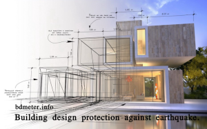
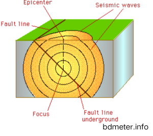
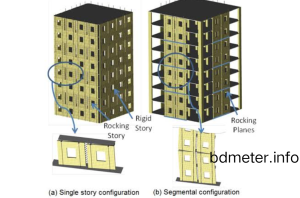

Buildings should be designed to withstand minor earthquakes without damage, because they may occur almost everywhere. For major earthquakes, it may not be economical to prevent all damage but collapse should be precluded. Because an earthquake and a high wind are not likely to occur simultaneously, building codes usually do not require that buildings be designed for a combination of large seismic and wind loads. Thus, designers may assume that the full strength of wind bracing is also available to resist drift caused by earthquakes. The methods of protecting against high winds described may also be used for protecting against earthquakes. Shaking of buildings produced by temblors, however, is likely to be much more severer than that caused by winds. Consequently, additional precautions must be taken to protect against earthquakes. Because such protective measures will also be useful in resisting unexpectedly high winds, such as those from tornadoes, however, it is advisable to apply aseismic design principles to all buildings. These principles require that collapse be avoided, oscillations of buildings damped, and damage to both structural and nonstructural components minimized.

Duplex building design against earthquake: bdmeter.info

Nonstructural components are especially liable to damage from large drift. For example, walls are likely to be stiffer than structural framing and therefore subject to greater seismic forces. The walls, as a result, may crack or collapse. Also, they may interfere with planned actions of structural components and cause additional damage. Consequently, aseismic design of buildings should make allowance for large drift, for example, by providing gaps between adjoining buildings and between adjoining building components not required to be rigidly connected together and by permitting sliding of such components. Thus, partitions and Bdmeter should be free to move in their frames so that no damage will occur when an earthquake wracks the frames. Heavy elements in buildings, such as water tanks, should be firmly anchored to prevent them from damaging critical structural components. Displacement of gas hot water heaters is a common cause of gas fires following earthquakes.

## Characteristics of earthquakes:

Earthquakes are produced by the sudden release of tremendous amounts of energy within the earth by a sudden movement at a point called the hypocenter. (The point on the surface of the earth directly above the hypocenter is called the epicenter.) The resulting shock sends out longitudinal, vertical, and transverse vibrations in all directions, both through the earth’s crust and along the surface, and at different velocities. Consequently, the shock waves arrive at distant points at different times. As a result, the first sign of the advent of an earthquake at a distant point is likely to be faint surface vibration of short duration as the first longitudinal waves arrive at the point. Then, severe shocks of longer duration occur there, as other waves arrive.

Earthquake protection guide for building

Movement at any point of the earth’s surface during a temblor may be recorded with seismographs and plotted as seismograms, which show the variation with time of displacements. Seismograms of past earthquakes indicate that seismic waveforms are very complex. Ground accelerations are also very important because they are related to the inertial forces that act on building components during an earthquake. Accelerations are recorded in accelerograms, which are a plot of the variation with time of components of the ground accelerations. Newton’s law relates acceleration to force:

**F = Ma = (w/g) a**  
_where F = force, lb  
M = mass accelerated  
a = acceleration of the mass, ft/s²  
W = weight of building component accelerated, lb  
g = acceleration due to gravity 32.2 ft/s²_  

### Seismic Scales:

For the study of the behavior of buildings in past earthquakes and the application of the information collected to contemporary aseismic design, it is useful to have some quantitative means for comparing earthquake severity. Two scales, the Modified Mercalli and the Richter are commonly used in the United States. The Modified Mercalli scale compares earthquake intensity by assigning values to human perceptions of the severity of oscillations and extent of damage to buildings. The scale has 12 divisions. The severer the reported oscillations and damage, the higher the number assigned to the earthquake intensity.

The Richter scale assigns numbers M to earthquake intensity in accordance with the amount of energy released, as measured by the maximum amplitude of ground motion:

**M = log A - 1.73 log (100/ D)  
**_where M = earthquake magnitude 100 km from the epicenter  
A = maximum amplitude of ground motion, micrometers  
D = distance, km, from the epicenter to the point where A is measured_

The larger the ground displacement at a given location, the higher the value of the number assigned on the Richter scale. A Richter magnitude of 8 corresponds approximately to a Modified Mercalli intensity, and for smaller intensities, Richter scale digits are about one unit less than corresponding Mercalli Roman numerals directions, both through the earth’s crust and along the surface, and at different velocities. Consequently, the shock waves arrive at distant points at different times. As a result, the first sign of the advent of an earthquake at a distant point is likely to be faint surface vibration of short duration as the first longitudinal waves arrive at the point. Then, severe shocks of longer duration occur there, as other waves arrive.

Movement at any point of the earth’s surface during a temblor may be recorded with seismographs and plotted as seismograms, which show the variation with time of displacements. Seismograms of past earthquakes indicate that seismic waveforms are very complex. Ground accelerations are also very important because they are related to the inertial forces that act on building components during an earthquake.

### Effects of Ground Conditions

The amplitude of ground motion at a specific location during an earthquake depends not only on the distance from the epicenter but also on the types of soil at the location. (Some soils suffer a loss of strength in an earthquake and allow large, uneven foundation settlements, which cause severe property damage.) The ground motion usually is much larger in alluvial soils (sands or clays deposited by flowing water) than in rocky areas or diluvial soils (material deposited by glaciers). Reclaimed land or earth fills generally undergo even greater displacements than alluvial soils. Consequently, in the selection of sites for structures in zones where severe earthquakes are highly probable during the life of the structures, preference should be given to sites with hard ground or rock to a considerable depth, with sand and gravel as a less desirable alternative and clay as a poor choice.

### Seismic Forces

During an earthquake, the ground may move horizontally in any direction and up and down, shifting the building foundations correspondingly. Inertial forces, or seismic loads, on the building, resist the displacements. Major damage usually is caused by the horizontal components of these loads, inasmuch as vertical structural members and connections generally have adequate strength to resist the vertical components. Hence, as for wind loads, buildings should be designed to resist the maximum probable horizontal component applied in any direction. Vertical components of force must be considered in the design of connections in high mass prefabricated elements such as precast concrete slabs and girders.

Seismic forces

Seismic forces vary rapidly with time. Therefore, they impose a dynamic loading on buildings. Calculation of the building responses to such loading is complex and is usually carried out only for important buildings that are very tall and slender. For other types of buildings, building codes generally permit the use of an alternative static loading for which structural analysis is much simpler.

### Aseismic Design:

The basic methods for providing wind resistance—shear walls, diagonal bracing, and rigid frames are also suitable for resisting seismic loads. Ductile rigid frames, however, are preferred because of their large energy-absorbing capacity.

Aseismic design

Building codes encourage their use by permitting them to be designed for smaller seismic loads than those required for shear walls and diagonal bracing. (Ductility is a property that enables a structural member to undergo considerable deformation without failing. The more a member deforms, the more energy it can absorb, and therefore the greater the resistance it can offer to dynamic loads.)  
For tall, slender buildings, the use of the basic methods alone in limiting drift to an acceptable level may not be cost-effective. In such cases, improved response to the dynamic loads may be improved by the installation of heavy masses near the roof, with their movements restricted by damping devices. Another alternative is the installation of energy-absorbing devices at key points in the structural framing, such as at the bearings of bottom columns or the intersections of cross bracing. Designers usually utilize floors and roofs, acting as horizontal diaphragms, to transmit lateral forces to the resisting structural members. Horizontal bracing, however, may be used instead. Where openings occur in floors and roofs, for example for floors and elevators, structural framing should be provided around the openings to bypass the lateral forces.
