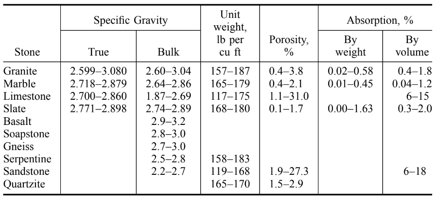
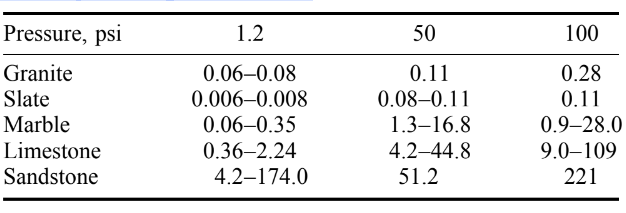
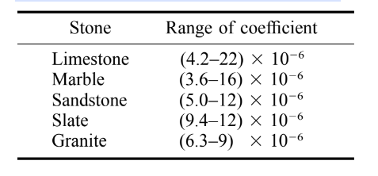

Principal building stones generally used in the United States are limestones, marbles, granites, and sandstones. Other stones such as serpentine and quartzite are used locally but to a much lesser extent. Stone, in general, makes an excellent  
building material, if properly selected on the basis of experience; but the cost may be relatively high.  
The properties of stone depend on what nature has provided. Therefore, the designer does not have the choice of properties and colors available in some of the manufactured building units. The most the stone producer can do for purchasers is to avoid quarrying certain stone beds that have been proved by experience to have poor strength or poor durability.

## PROPERTIES OF BUILDING STONES

Data on the strength of building stones are presented in Table 4.10, summarized  
from U.S. National Bureau of Standards Technical Papers, No. 123, B. S. Vol. 12;

### **TABLE 4.10 Strength Characteristics of Commercial Building Stones**

| Stone | Compressive  
strength,  
psi,  
range | Modulus  
of rupture,  
psi,  
range | Shear  
strength,  
psi,  
range | Tensile  
strength,  
psi,  
range | Elastic  
modulus,  
psi,  
range | Toughness | Toughness | Wear  
resistance | Wear  
resistance |
| --- | --- | --- | --- | --- | --- | --- | --- | --- | --- |
|  |  |  |  |  |  | Range | Avg | Range | Avg |
| Granite  
Marble  
Limestone  
Sandstone  
Quartzite  
Serpentine  
Basalt  
Diorite  
Diorite  
Slate  
Diabase  
Building limestone | 7,700–60,000  
8,000–50,000  
2,600–28,000  
5,000–20,000  
16,000–45,000  
11,000–28,000  
28,000–67,000  
16,000–35,000  
14,000–28,000  
  
  
 | 1,430–5,190  
600–4,900  
500–2,000  
700–2,300  
  
1,300–11,000  
  
  
  
6,000–15,000  
  
 | 2,000–,800  
1,300–,500  
800–4,580  
300–3,000  
  
  
  
  
  
2,000-3,600  
  
 | 600–1,000  
150–2,300  
280–890  
280–500  
  
800–1,600  
  
  
  
3,000–4,300  
  
 | 5,700,000–8,200,000  
7,200,000–14,500,000  
1,500,000–12,400,000  
1,900,000–7,700,000  
  
4,800,000–9,600,000  
  
  
  
9,800,000–18,000,000  
  
 | 8–27  
2–23  
5–20  
2–35  
5–30  
  
6–38  
6–38  
  
10–56  
6–50  
3–8 | 13  
6  
7  
10  
15  
  
23  
23  
  
  
19  
4.4 | 43.9–87.9  
6.7–41.7  
1.3–24.1  
1.6–29.0  
  
13.3–111.4  
  
  
  
5.6–11.7  
  
 | 60.8  
18.9  
8.4  
13.3  
  
46.9  
  
  
  
7.7  
  
 |

**TABLE 4.10 Strength Characteristics of Commercial Building Stones**

No. 305, Vol. 20, p. 191; No. 349, Vol. 21, p. 497; Journal of Research of the National Bureau of Standards, Vol. 11, p. 635; Vol. 25, p. 161). The data in Table 4.9 pertain to dried specimens. Strengths of saturated specimens may be either  
greater or less than that of completely dry specimens.  
The modulus of rupture of dry slate is given in Table 4.10 as ranging from 6000 to 15,000 psi. Similar slates, tested wet, gave moduli ranging from 4700 to 12,300 psi. The ratio of wet modulus to dry modulus varied from 0.42 to 1.12 and averaged 0.73. 
Data on the true specific gravity, bulk specific gravity, unit weights, porosity, and absorption of various stones are given in Table 4.11. Permeability of stones varies with types of stone, thickness, and driving pressure that forces water through the stone. Table 4.12 represents data for the more common stones at three different pressures, as reported in ‘‘Permeability of Stone,’’ U.S. National Bureau of Standards Technical Papers, No. 305, Vol. 20, p. 191. The units of measurement of permeability are cubic inches of water that will flow through a square foot of a specimen 1⁄2 in thick in 1 hr.

Data on thermal expansion of building stones as given in Table 4.13 show that limestones have a wide range of expansion as compared with granites and slates. Marble loses strength after repeated heating and cooling. A marble that had an  
original strength of 9174 psi had a strength after 50 heatings to 150C of 8998 psi—a loss of 1.9%. After 100 heatings to 150C, the strength was only 8507 psi, or a loss of 7.3%. The latter loss in strength was identical with that obtained on freezing and thawing the same marble for 30 cycles. Also, marble retains a permanent expansion after repeated heating.

### **TABLE 4.11 Specific Gravity and Porosity of Commercial Building Stones**

### **TABLE 4.12 Permeability of Commercial Building Stones** (in3 /(ft2 )(hr) for 1 ⁄2-in thickness)

### TABLE 4.13 Coefficient of Thermal Expansion of Commercial Building Stones

###
