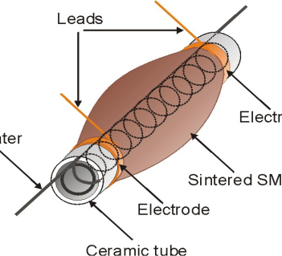

## Smoke and Chemical Sensors:

The detection of smoke, radiation, and chemicals is of great importance in industrial processing not only as it relates to the safety of humans and the control of environmental pollution both atmospheric and ground but is also used in process control applications to detect the presence, absence, or levels of impurities in processing chemicals.

Smoke detectors and heat sensors (automatic sprinklers) are now commonplace in the industry for the protection of people, and equipment, and for monitoring and control of chemical reactions. Low-cost smoke detectors using infrared sensing or ionization chambers are commercially available. Many industrial processes use a variety of gases in processing–such as inert gases (nitrogen)—to prevent contamination from oxygen in the air, or conversely, gases or chemicals can be introduced to give a desired reaction. It is therefore necessary to be able to monitor, measure, and control a wide variety of gases and chemicals. A wide variety of gas and chemical sensors are available. Of these, the Taguchi-type sensor is one of the more common types of sensors.

### Smoke and chemical measuring devices

Infrared sensors detect changes in the signal received from a light-emitting diode due to the presence of smoke in the light path or the presence of an object in the light path. Ionization chambers are devices that detect the leakage current between two plates that have a voltage between them. The leakage occurs when carbon particles from smoke are present and provide a conductive path between the plates.

Taguchi-type sensors are used for the detection of hydrocarbon gases, such as carbon monoxide and dioxide, methane, and propane. The Taguchi sensor has an element coated with an oxide of tin that combines with hydrocarbon to give a change in electrical resistance which can be detected. Periodically the element is heated and the chemical reaction is reversed, reducing the coating back to tin oxide. Likewise, the sensing process can be repeated. The tin oxide can be made sensitive to different hydrocarbons by using different oxides of tin, different deposition techniques, and so on.

Image: Taguchi-type sensors

### Smoke and chemical application consideration

Many hazardous, corrosive, toxic, and environmentally-unfriendly chemicals are used in the processing industry. These chemicals require careful monitoring during use, transportation, and handling. In a basic text it is not possible to cover the above-mentioned sensors’ availability and precautions in their applications, but just to make the student aware of their existence. Analysis labs and control rooms must meet the code; further information can be obtained from the ISA series RP 60 practices. All processing plants and labs will have an alarm system that can shut down certain operations if a problem occurs. These systems are regularly tested and are often duplicated to provide built-in fail-safe features such as redundancy as protection against sensor failure.
