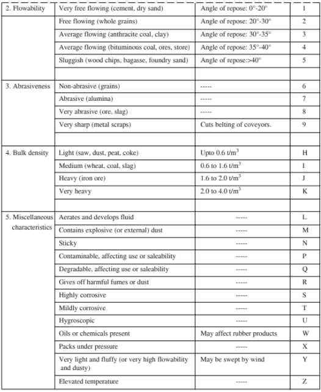
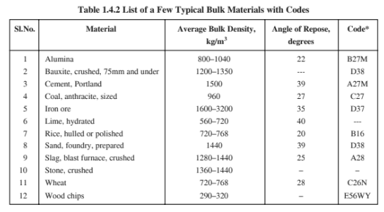

An air-water mixture is found from the heat and mass balance to be at 60°C (333 K) and 0.025 kg/kg (25 g/kg) absolute humidity. Calculate the other main parameters for the mixture. Take atmospheric pressure as 101,325 Pa.

Method: Consult item (vi) in Table 12-5 for the calculation methodology.  
From the initial terminology section, specific humidity YW = 0.02439 kg/kg, mole ratio z = 0.0402 kmol/kmol, mole fraction y = 0.03864 kmol/kmol.

From Table 12-1, vapor pressure p = 3915 Pa (0.03915 bar) and volumetric humidity Yv = 0.02547 kg/m3. 
The dew point is given by the temperature corresponding to p at saturation. From the reversed Antoine equation (12-5), Tdp = 3830/(23.19 − ln 3915) + 44.83 = 301.58 K = 28.43°C.

The relative humidity is the ratio of actual vapor pressure to saturation vapor pressure at dry-bulb temperature. From the Antoine equation (12-5), ps = exp \[23.19 − 3830/(333.15 − 44.83)\] = 20,053 Pa (new coefficients), or ps = exp \[23.1963 − 3816.44/(333.15 − 46.13)\] = 19,921 Pa (old coefficients).

From the Sonntag equation (12-4), ps = 19,948 Pa; the difference from Antoine is less than 0.5 percent. Relative humidity = 100 × 3915/19,948 = 19.6 percent. From a psychrometric chart, in Fig. 2, a humidity of 0.025 kg/kg at T = 60°C lies very close to the adiabatic saturation line for 35°C. Hence a good first estimate for Tas and Twb will be 35°C. Refining the estimate of Twb by using the psychrometer equation and iterating given by Bdmeter.info

Fig: 2 – Grosvenor psychrometric chart for the air-water system at standard atmospheric pressure, 101,325 Pa, SI units. (Courtesy Carrier Corporation.)

pwb = 3915 + 6.46 × 10−4 (1.033)(101,325) (60 − 35) = 5605  
  
From the Antoine equation,  
Twb = 3830/(23.19 − ln 5605) + 44.83 = 307.9 K = 34.75°C  
  
Second iteration:  
pwb = 3915 + 6.46 × 10−4 (1.033)(101,325)(60 − 34.75) = 5622  
Twb = 307.96 K = 34.81°C.  
  
To a sensible level of precision, Twb = 34.8°C.

Table 12: Interconversion Formulas for Air-Water System, to 3 Significant Figures
