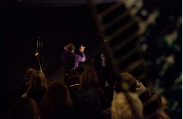

## Introduction:

If some time ago textile materials were considered good sound insulators, their present programmability is about to change their definition, transforming them into musical instruments and tools of sound measurement and visualization. By comparison to the analogue world, the notions of texture and touch are gaining new connotations, while the new textures and ‘smart gestures’ are introducing a new expressivity. Following a series of inquiries in physical computing, the present text will present a series of new configurations between texture, touch and sound and the connections between them in both analogue and digital environments. The paper will focus on a series of practice-based research related to the integration of touch and sound sensors into textile structures, as well as on the translation of sound components into dynamic textile patterns. 

## Introduction

The programmability of matter is about to change the parameters of the equation that defines materials as we used to know them. If textiles are good sound insulators, we see today research which brings together textiles and sound. Because of their texture, we associate easily textiles and touch, the idea of connecting textiles, sound and touch developed little by little. 

In the present paper I will present different layers of correlation between textiles, touch and sound and the ways they change in analogue and digital environments. After brief historical considerations, I will present a curatorial project and some of the works exhibited. It is to be said from the beginning that my choice to present a curatorial project as a form of practice-based research is related to the fact that I understand the curatorial process as a form of “thinking with others”, as a form of bringing together different perspectives related to the same issues, as a collimator of ideas. The exhibition project I’m referring to is Haptosonics and was presented in Oslo in October 2013 at Atelier Nord. Also, given the degree of experimentation, I consider that art research can provide an advanced insight on the appropriation of new materials and structures.

## Preliminary considerations

In the XVIII century, along with the founding of aesthetics as discipline, the specificity of the artistic medium started to
be particularly discussed. At that time, German philosopher Gotthold Lessing [1] revolted against Charles Batteux’s idea that all arts should be defined by the same principle. In Lessing’s vision, some subjects were much more suitable to be approached by a certain medium than others: for example, poetry, as a time-based art, was much more adapted to represent action, while painting - as a spatial art - was about to  address the representation of moments. What Lessing’s theory states, is that the aim of each form of expression is to achieve a maximum aesthetic effect by using minimum means of production. If we were to reformulate his theory in economic terms, than its goal was to confer a certain aesthetic “efficiency” to the artistic product. This “efficiency” was about to be achieved by taking into consideration the limitations of the material, and the sensorial channels through which it mainly acts on the public/users.

This quest for the specificity of the medium, and implicitly, the necessity of following its particular effects by mastering it, composed the body of most modernist theories, either art or craft related. Following its manifesto [2], the division of Bauhaus’ school into workshops by the material used, was pointing to the necessity of establishing methodologies for every discipline in order to ensure the acquisition of technical competences and, by doing so, to allow pertinent and critical interventions. But to form trained competences is, as I allow myself to put it, to form some sort of artistic and aesthetic “automatisms”, which would allow to better respond to industrial forms of ideation and production. These forms of production were about to reproduce serial objects and to answer universal needs. And the aesthetic dimension, understood as sensitive appropriation [3], was considered a universal need.

Still, as some critics have observed [4], things become much more complicated as soon as we are approaching more complex media that address multiple senses at the same time. It is the case of performative media like film and theatre for which we cannot identify the specific materials that compose them, and therefore we have difficulty assigning the specific aesthetic effects these media should engage. The authenticity of the medium is from this point of view critical, and therefore the “aesthetic efficiency” comes in question, as well.

It is precisely this performativity which is at stake when we have to approach the new electronic and reactive textiles. Since, in most of the cases synthetic and digital controlled materials are defined as “highly engineered materials that respond intelligently to their environment” [5] we can notice a shift in the way we understand the matter today. There are not so much the properties of the materials which are to be emphasized, but their performativity and the control of their performativity. With the new materials, we are not only concerned by the shaping of the matter, but also by its restructuration and its inner properties. Textiles are not materials with fixed properties anymore; they are objects that can virtually change their states, transforming themselves, acting according to the data of the environment.

Moreover, as Ezio Manzini [6] has noted, the identity of materials can be generally defined both in terms of physical and cultural performances. If in the past, materials had  constituted a sort of language due to their long presence in culturally connoted environments (which confer them a certain semiotic stability), with the new materials, these cultural automatisms dissolve and new significant forms have to emerge.

Taking into consideration all these aspects, we can ask ourselves how our aesthetic parameters are configured in the context of interactive and reactive textiles. The present paper will question therefore some possible approaches to the multiples forms of relationship between the properties of textiles, and their virtual states and forms of interaction. More specifically, we will direct our attention to the relationship established between textiles, haptics and sound and new ways they can interact.

## Aesthetic Properties of Textiles

Before we can answer what defines the aesthetics of electronic and reactive textiles we should see what defines the aesthetic of textiles in general. 

### The Texture of Textiles

While writing on weaving, Annie Albers, the well-known Bauhaus textile artist and designer, referred to tactile sensibility as a specific quality of textiles surfaces. This quality was given by what she called matière, a “quality of appearance, (...) an aesthetic quality and therefore a medium of the artist” [7]. Like colour, matière is not to be experienced intellectually, it is not analytical, but it is to be enjoyed and valued for no other reason than its intriguing play of surfaces. What Annie Albers calls matière is the texture of textile surfaces, and it is the result of a grouping of fibers producing a surface. Texture is an intrinsic quality of fabric and it is a state that defines both its parts, the fibers that compose the fabric, as its “in-betweens.”

To quote Annie Albers: “Matière it is to be defined by grain, roughness, smoothness, dullness or gloss, etc., qualities of appearance that can be observed by touch and are consequently not concerned with lightness or darkness. There seems to be no common word for the tactile perception of properties related to the inner structure of the material, like pliability, sponginess, brittleness, porousness, etc.”.

The observation of texture can be done also according to the different “incidences of light”. The sense of perception changes according to this incidence. As the painter Pierre Soulage [9] had noticed, light incidences are translating the difference between “materiality and reality”, between substance and apprehension. Touching and visual sensing collaborate in this case into a synesthetic apprehension.

Moreover, texture can be perceived by the way the matter folds. All materials fold in their own way. Thus the texture is precisely the expression of what Gilles Deleuze [10] had called the “theater of materials.” This “theater of materials” is a space of senses, a space of relations. The way a fabric drapes translates the fibers’ flexibility and participates in their semiotic interpretation. 

And to quote once again Annie Alberts about the task of designer’s work:

“Our experiments in surface effects are therefore to be understood only as exercises to increase our awareness of surface activities, since the actual work of weaving is only in part concerned with the epidermis of the cloth. The inner structure together with its effects on the outside are the main considerations. ”

### Textiles and Sound

Textiles were for long used to insulate against the sound. It was one of the discoveries of the XIX century research that long curtains can be used as noise barriers to absorb the sound waves coming from outside houses. Depending on the curtain’s density and the porosity of textile material, the soundproofing can be more or less consistent. But also, we have to keep in mind that some textiles sound. Some fabrics’ rustle can become part of their aesthetic identity. As Marcel Proust’s “Madeleine” [12], the noise of rich cloths is similar to the scent of a perfume and can create a play of correlations.

### Touch

The brief description of the fabrics texture allows us to notice that the versatility of the texture is doubled by the multiplicity of the senses that concur in its apprehension. Sensing the texture is not an unequivocal fact. Vision, hearing, and touch tie into one another and communicate to each other. But more than in any other art and design forms, textiles are perceived by touch. Touch is one of our primary senses and it is one of the most sophisticated. Like smell and taste it is an ephemeral stimuli and it tends to occur alongside synesthetic configurations. By touching, we are evaluating the consistency of the things, their state, their temperature. Touching is approaching, stopping over, raising feelings of affection; it is a form of perception and appropriation that involves both the intimate contact and the transformative relationship. It is precisely this ransformative relationship that places touch in the proximity of gesture. If touching reveals sensing, the gesture reveals doing and acting. And this proximity and ambivalence makes of haptics an imprecise and ambiguous sense.

## Aesthetics of Electronic and Reactive Textiles

When speaking about the aesthetic of electronic and reactive textiles we can differentiate between two perspectives. One that keeps a difference between textiles and electronics and another that speaks about the emergence of a totally new medium combining the two and asking for a completely new approach. 

The first perspective is, for example, embraced by Leah Buechley [13], for which the aesthetic aspects of textiles are of
primary importance since they are communication devices mixing aesthetic pleasure with cultural codes. For her, the aesthetic aspects are directly related to the textile material. On the other hand, she affirms that there should be no hierarchical discrepancy between the textiles’ aesthetics and their electronic characteristics, meaning by that there should be no hierarchy between different technical competencies. What Leah Buechley proposes it is more a hybridization of old and new techniques, not in the name of aesthetic efficiency, but to maintain the diversity of aesthetic and practice forms.

On another hand, Joanna Berzowska [14], following the modernist tradition, considers that a better understanding of electronic and smart textiles can be had only through a good understanding of their potential and their limitations. From her point of view, it is not only about combining textiles and electronics, but about the conception of an entire new medium which has to be tested, transformed and re-invented. And to achieve such an expressivity one should explore the “natural” expressivity of the electronic circuits and of the human body (since most of the devices are conceived for wearables). This expressivity is a form of aesthetic efficiency, and the role of the designer would be to conceive the appropriate and necessary forms of interaction.

## Haptosonics exhibition

Haptosonics was an exhibition project started in 2012 in the frame of Soft Technology platform initiated by Hillevi Munthe in collaboration with Atelier Nord in Oslo. The exhibition I co-curated with Hillevi Munthe took place in October 2013 and was also presented in the beginning of 2014 in KinoKino Sandnes, Norway.

The term of “haptosonics” was born from the juxtaposition of “haptic” and “sonic” and it is a term I coined in order to translate our incursion into the world of physical computing  that exploits the relationships that can be established between tactile and acoustic forms of experience. Focusing on the potential of the alliance between digital technologies and textiles, the project tried to present some of the most relevant approaches of computational aesthetics in the field of textiles, exploiting their “augmented” properties through electronics. 

As we stated in our foreword [15], the curatorial selection considered artworks which, by making use of digital translation of physical data, are exploiting both the physical properties of the textile material, as well as the perceptive aspects involved in the perception of the textile installations. It was an investigation of the ways in which textiles, sound and touch are associated with each another.

Another aspect of our selection was the relationships that can be established between textiles and their environment, between textile objects and their users. The works chosen to be presented in this exhibition are either transforming the fabrics in sound instruments, or translating in sound different qualities of touch. In this way the textiles are both the site of interactive performance and an interactive record. 

Below I will present five of the works exhibited in the context of the exhibition. It is about E-Static Shadow by Zane Berzina, Text in Texiles by Anna Biro, XY Interaction by Maurin Donneaud, Centre of Attention by Luke Fishbeck and Hedgehog Fabric by myself.

### E-Static Shadows

The E-Static Shadows by Zane Berzina and Jackson Tan investigates the aesthetics of an electrostatic touch and marks the presence of humans through an e-textile display made of LEDs, soft circuitry, and industrial transistors. As Zane Berzina explains: “Within the context of the E-Static Shadows installation, it is each person’s static “aura” which touches the surface of the sensitive e-textiles “skin”, thus creating the dynamic audio-visual responses without the person actually (physically) touching the membrane. Due to this contradicting experience (touching without physically touching) people often perceive the installation as something magic.” [16] The installation also allows that the sound of static electricity to be heard, transforming the textile surface into a musical instrument responding to charged touches of the visitors. It is the genuine buzz of material responding to the static touch. The decision not to use amplifiers was due to the fact that the artists/designers were looking to stay in the limits of the analogue performance. 

### Text in Textiles

Anna Biro started to work on the concept of Text in Textile installation about a decade ago when she weaved a series of fabrics on a computerized jacquard handloom using audiotape as thread. The tapes were discarded by an anthropologist who preliminary had used them for the recording of a series of interviews with immigrants living in Montreal. The artist used the recordings in order to give a second life to this rich collection of memories. While touching the tapes weaved fabric, we activate the recordings from the tape. Text in Textiles is composed of three individual pieces, where the visitors are active participants in a tactile and acoustic creative process. As they walk across the sound carpet, their feet trigger a chorus of voices depending on when and where you step. Playback frequency is determined by a single resistor (a simple electronic component); thus the human body acts like a resistor, becoming part of the circuit and affecting the replay of the recordings.

### XY Interaction

XY Interaction is a musical fabric conceived by Maurin Donneaud. It is a project which translates into practice the idea
of a fabric that could be an expressive surface for interpretation, as well as a platform for electronic music
composition. The softness of textiles brings a somehow immaterial dimension to the fact that XY Interface is a sort of
hardware. There is also a connection between the softness of the textile material and the nature of the sound,
between the almost danced gestures and the music. The sound elements are graphically represented on the fabric, enabling the composer to locate them and play (with) them. Several possible gestures were taken into consideration
and special software was conceived for the interpretation of the gesture vocabulary. A matrix based textile sensor was
integrated into the fabric’s structure in order to catch all the gestures performed on the fabric. If the composer draws
a circle on the surface of the fabric, or a triangle, the computer is informed about this sign and it can then navigate in
the software by using these symbolic forms chosen by the designers. And since the fabric is also an instrument for
public performance, it was also important that the symbolic vocabulary was as expressive as possible. 

### Center of Attention

Center of Attention is an interactive installation by Luke Fischbeck where the visitors are invited to create their own spontaneous compositions using the same synthesizer and by touching a series of robes as well as by touching one another on the skin. Touch is seen in this context as a form of social exchange, while the physical interaction is connected to sounds and sensory information determining the form of sound objects we are making together. The performance is at the center of the installation and depending on the touch patterns (which robes are touched), it recalls different sound patterns. The complexity of the installation depends on the number of the visitors and the way they interact to each other. 

### Hedgehog Fabric

Hedgehog Fabric is an interactive textile installation inspired by the way hedgehogs react to different sound stimuli. It is a project which tries to draw attention to the increased noise pollution. The rhythms of modern city life is generally accompanied by an increased, excessive environmental noise that disrupts in human life. The Hedgehog Fabric combines flexible dynamic textiles structures controlled electronically with the help of an Arduino board. When the intensity of sound increases, the dynamic structures will set out its “Spines” becoming unfriendly in order to protect itself. Contrary to the other works presented into the framework of Haptosonics exhibition, the installation does not produce sound, but react to sound. It is the sound that touches and puts into motion the textiles dynamic structures. 

## Conclusion 

In this paper I presented a series of works which were part of Haptosonics exhibition. By describing them and by calling into attention the status of the specificity of the materials, I put into the discussion the status of electronic and reactive textiles aesthetics. I questioned notions like texture, touch and sound and the way they establish correlations to each other. As the works presented show, electronic textiles open a new language that connects traditionally opposing fields like interactive communication technologies with textiles and soft materials. Still, we have to have in mind that the aesthetics of electronic and reactive textiles and that of traditional textiles balance and enrich each other. Parallel to the textiles traditional aesthetic efficiency, the electronic and reactive textiles “new expressivity” is still to be researched and tested. The different layers of composition between textiles and electronic augment or distort the traditional qualities of textiles. As we have showed through our curatorial project, the aesthetics of electronic and reactive textiles it is not only about making appeal to the common apprehensions, or about reinventing new forms of apprehension, but it is about approaching them in a complementary way. Moreover, the performativity of electronic textiles push us to pay attention to the convergence between textiles and our own interaction with them and through them. It is precisely the complexity of these forms of interactivity that makes electronic textiles source of reflexive material and bring into the question not only the elements that compose the electronic and reactive textiles medium, but also their content and significance.

